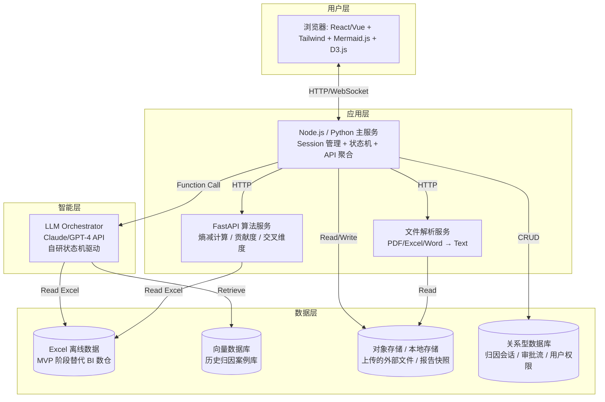
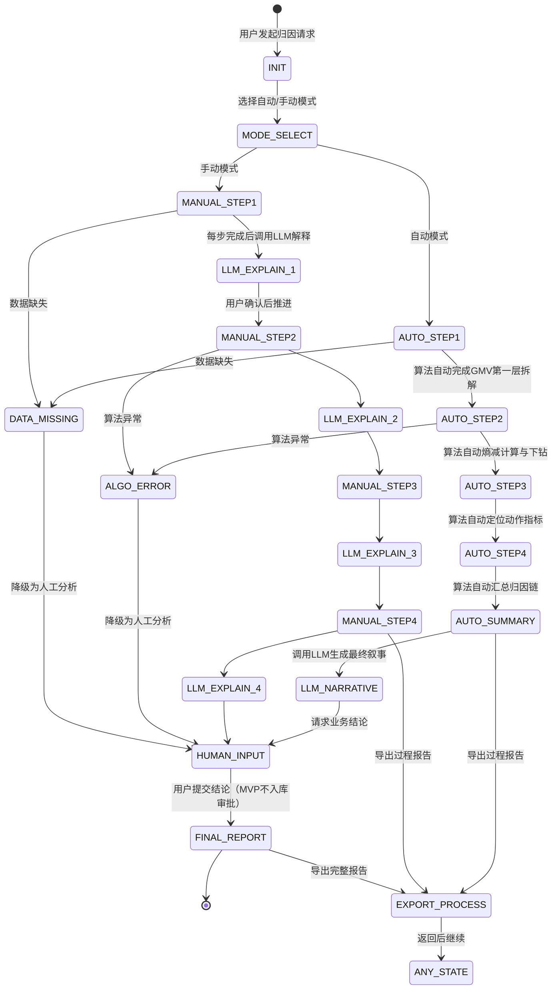
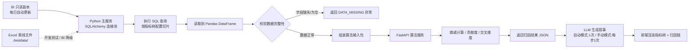

# GMV 下滑智能归因系统 - 产品需求文档（PRD）

> **文档状态**：Phase 1 架构与数据模型设计中  
> **目标读者**：系统架构师、产品经理、前后端工程师、算法工程师、大模型开发工程师  
> **设计原则**：第一性原理——从"决策者需要看到什么结论"倒推"系统需要计算什么"

---

## 1. 项目概述

### 1.1 背景
企业管理者在发现 GMV 下滑时，需要快速回答两个问题：**谁该负责？** 和 **具体是什么业务原因？**。传统 BI 只能展示数据，Data Agent 只能做浅层归因，而咨询报告虽然深入但成本高、周期长。本系统旨在融合三者优点，构建一个**机器完成 80% 技术拆解、人类补充 20% 业务结论**的 GMV 智能归因工作站。

### 1.2 产品目标
- **定责效率提升 60%**：通过组织侧指标树快速定位责任方（区域/部门/负责人）。
- **定位时间缩短 50%**：通过经营侧指标树 + 熵减算法自动拆解到动作指标。
- **输出可直接落地的归因报告**：责任 + 原因双落地，支撑 Q3 GMV 增长目标。

### 1.3 MVP 边界
- **单一指标**：只聚焦 GMV 的下滑归因（暂不扩展至利润、DAU 等）。
- **单一触发模式**：按需触发，由用户主动发起一次归因分析任务。
- **单一交付形态**：独立 Web 应用。

---

## 2. 核心决策汇总（已通过访谈确认）

| 维度 | 决策 |
|------|------|
| **产品边界** | GMV 下滑单点打透；独立 Web 应用；按需触发 |
| **技术架构** | LLM as Orchestrator；裸调大模型 API（Claude/GPT-4）+ 自研状态机；后端 Python 服务（FastAPI）执行算法 |
| **指标树维护** | YAML/JSON 配置文件 + Git 版本控制 |
| **数据策略** | 主数据复用现有 BI 数仓；允许上传外部文件（PDF/Excel/Word）作为补充输入；历史案例通过 RAG 向量检索复用 |
| **交互设计** | 三栏式页面（时间轴 / 指标树 / 节点详情）+ 底部归因链；权限自适应（管理者看双组织树，业务侧只看经营侧） |
| **人工闭环** | 结构化模板填空补充业务结论；结论需管理者审批后进入 RAG 案例库 |
| **输出物** | 交互式可视化 + 过程报告/完整报告导出（Word/PDF） |

---

## 3. Phase 1: 系统架构与数据模型

### 3.1 系统架构图

本系统采用**前后端分离 + 轻量级状态机 + 大模型 API 调用**的架构。核心设计理念是：**算法层（Python FastAPI）负责精确计算，LLM 层负责编排流程和生成叙事，前端层负责可视化呈现和人机交互。**



**架构说明：**
1. **浏览器前端**：负责三栏式可视化、文件上传、报告预览/导出、权限视图切换。
2. **主服务（Python，如 FastAPI + 同步任务调度）**：负责用户 Session 管理、状态机推进、API 路由聚合、审批流和权限控制。
3. **FastAPI 算法服务**：纯计算服务，无状态，接收指标树配置和原始数据，返回熵减结果、贡献度、交叉维度分析。
4. **LLM Orchestrator**：通过自研状态机与大模型 API 交互，根据当前状态决定下一步动作（调用算法服务、读取 Excel、生成自然语言、请求用户输入）。
5. **数据层（MVP 阶段）**：
   - **Excel 离线数据**：MVP 阶段主数据来源，由数据团队定期导出并放置于指定目录。算法服务和主服务通过 `pandas` 读取。后续可平滑迁移至 BI 数仓。
   - 向量数据库：存储历史归因案例的 embedding，供 RAG 检索。
   - 对象存储/本地存储：存放用户上传的外部文件、导出的报告模板/快照。
   - 关系型数据库：存储归因会话状态、用户权限、审批记录。

### 3.2 双组织指标树 JSON Schema

指标树是系统的**骨架**。为避免概念混淆，我们明确区分**两种树结构**：
1. **组织树（Organization Tree）**：预定义的企业管理架构，按全球→区域→国家→部门→负责人层级下钻，用于快速定责。**不经过熵减算法选择**，直接按层级展开。
2. **经营树 + 维度池（Operation Tree + Dimension Pool）**：包含数学分解项（如 $GMV = UV \times CR \times AOV$）和横向业务维度切分选项（如区域、产品、渠道）。**熵减算法在维度池中选择最佳切分维度**，驱动下钻路径。

双组织树以 GMV 为根，第一层直接分叉为**组织侧**和**经营侧**。

```json
{
  "$schema": "http://json-schema.org/draft-07/schema#",
  "title": "DualOrgIndicatorTree",
  "type": "object",
  "properties": {
    "version": { "type": "string", "description": "配置文件版本号" },
    "root": {
      "type": "object",
      "properties": {
        "id": { "type": "string", "const": "gmv" },
        "name": { "type": "string", "const": "GMV" },
        "unit": { "type": "string", "const": "元" },
        "formula": { "type": "string", "const": "uv * conversion_rate * avg_order_value" },
        "children": {
          "type": "array",
          "items": { "$ref": "#/definitions/node" },
          "minItems": 2
        },
        "dimension_pool": {
          "type": "array",
          "items": { "$ref": "#/definitions/dimension" },
          "description": "当前节点可用的横向维度切分选项（仅经营侧/混合节点使用）"
        },
      },
      "required": ["id", "name", "children"]
    }
  },
  "required": ["version", "root"],
  "definitions": {
    "node": {
      "type": "object",
      "properties": {
        "id": { "type": "string", "description": "全局唯一标识，如 org_asia_pacific" },
        "name": { "type": "string", "description": "指标显示名称" },
        "type": {
          "type": "string",
          "enum": ["organization", "operation", "action"],
          "description": "节点类型：组织侧 / 经营侧 / 动作指标"
        },
        "level": { "type": "integer", "description": "层级深度，根节点为0" },
        "level_code": { "type": "string", "description": "层级编号，如 L1、L2、L3，用于快速标识和报告输出" },
        "parent_id": { "type": "string", "description": "父节点id" },
        "formula": {
          "type": ["string", "null"],
          "description": "精确的数学分解公式，如 uv * conversion_rate"
        },
        "pseudo_weight": {
          "type": ["number", "null"],
          "description": "无明确公式时的业务影响系数（伪权重）"
        },
        "weight": {
          "type": ["number", "null"],
          "description": "该节点在上层指标中的权重，用于贡献度计算"
        },
        "entropy_threshold": {
          "type": "number",
          "default": 0.2,
          "description": "熵减阈值，大于此值才视为关键影响维度"
        },
        "data_source": {
          "type": "object",
          "properties": {
            "db_view": { "type": "string", "description": "BI只读视图名，如 bi_readonly.daily_gmv" },
            "field": { "type": "string", "description": "指标字段名" },
            "filter": { "type": "string", "description": "SQL过滤条件模板，支持{{start}} {{end}}变量" },
            "agg_func": { "type": "string", "enum": ["SUM", "AVG", "COUNT", "MAX", "MIN"], "default": "SUM", "description": "聚合方式" },
            "group_by": { "type": "array", "items": { "type": "string" }, "description": "分组字段列表" }
          },
          "required": ["db_view", "field"]
        },
        "permission_scope": {
          "type": "array",
          "items": { "type": "string" },
          "description": "可见该节点的角色或区域代码列表"
        },
        "children": {
          "type": "array",
          "items": { "$ref": "#/definitions/node" }
        }
      },
      "required": ["id", "name", "type", "level"]
    },
    "dimension": {
      "type": "object",
      "properties": {
        "dimension_name": { "type": "string", "description": "维度名称，如 区域、产品、渠道" },
        "dimension_id": { "type": "string", "description": "维度唯一标识" },
        "child_nodes": {
          "type": "array",
          "items": { "type": "string" },
          "description": "该维度下所有子类别对应的指标树节点id列表"
        },
        "data_slice_rule": {
          "type": "object",
          "description": "从原始数据中提取该维度各子类别的数据切片规则",
          "properties": {
            "source_view": {
              "type": "string",
              "description": "数据来源的BI只读视图名，如 bi_readonly.region_gmv"
            },
            "group_by_field": {
              "type": "string",
              "description": "用于维度切分的分组字段名，如 'region'、'product_category'"
            },
            "metric_field": {
              "type": "string",
              "description": "需要聚合的指标字段名，通常与父节点的 data_source.field 一致"
            },
            "agg_func": {
              "type": "string",
              "enum": ["SUM", "AVG", "COUNT", "MAX", "MIN"],
              "default": "SUM",
              "description": "聚合方式"
            },
            "filter_template": {
              "type": "string",
              "description": "额外的SQL过滤模板，用于限定该维度切分的数据范围"
            },
            "child_mapping": {
              "type": "array",
              "items": {
                "type": "object",
                "properties": {
                  "node_id": { "type": "string", "description": "指标树节点id" },
                  "group_value": { "type": "string", "description": "该节点在group_by_field中对应的取值" }
                },
                "required": ["node_id", "group_value"]
              },
              "description": "子节点id与数据分组取值的映射关系"
            }
          },
          "required": ["source_view", "group_by_field", "metric_field"]
        }
      },
      "required": ["dimension_name", "dimension_id", "child_nodes"]
    }
  }
}
```

#### 配置示例片段（MVP 简化版）

```yaml
version: "1.0.0"
root:
  id: gmv
  name: GMV
  unit: 元
  formula: "uv * conversion_rate * avg_order_value"
  entropy_threshold: 0.2
  children:
    # ========== 组织侧（预定义层级，不走熵减选择） ==========
    - id: org_side
      name: 组织侧
      type: organization
      level: 1
      level_code: L1
      weight: 1.0
      children:
        - id: org_asia_pacific
          name: 亚太区
          type: organization
          level: 2
          level_code: L2
          weight: 0.4
          data_source:
            db_view: bi_readonly.region_gmv
            field: gmv
            filter: "region == 'Asia_Pacific'"
          children:
            - id: org_sg
              name: 新加坡
              type: organization
              level: 3
              level_code: L3
              weight: 0.6
              children:
                - id: org_sg_marketing
                  name: 新加坡市场部
                  type: organization
                  level: 4
                  level_code: L4
                  weight: 1.0
                  permission_scope: ["sg_marketing_manager", "global_manager"]
    # ========== 经营侧（含数学分解 + 维度池） ==========
    - id: op_side
      name: 经营侧
      type: operation
      level: 1
      level_code: L1
      weight: 1.0
      formula: "op_user + op_product + op_marketing + op_supply_chain"
      children:
        - id: op_user
          name: 用户
          type: operation
          level: 2
          level_code: L2
          formula: "uv * conversion_rate * avg_order_value"
          children:
            - id: op_uv
              name: UV
              type: operation
              level: 3
              level_code: L3
              formula: "new_user_uv + old_user_uv"
              dimension_pool:
                - dimension_name: 用户类型
                  dimension_id: dim_user_type
                  child_nodes: ["op_new_user_uv", "op_old_user_uv"]
              children:
                - id: op_old_user_uv
                  name: 老客UV
                  type: operation
                  level: 4
                  level_code: L4
                  dimension_pool:
                    - dimension_name: 会员活动
                      dimension_id: dim_member_activity
                      child_nodes: ["act_member_day_participation", "act_weekly_checkin"]
                  children:
                    - id: act_member_day_participation
                      name: 会员日活动参与率
                      type: action
                      level: 5
                      level_code: L5
                      pseudo_weight: 0.35
                      data_source:
                        db_view: bi_readonly.user_activity
                        field: member_day_participation_rate
        - id: op_marketing
          name: 营销
          type: operation
          level: 2
          level_code: L2
          children:
            - id: op_ad_traffic
              name: 广告流量
              type: operation
              level: 3
              level_code: L3
              formula: "ad_impression * ctr * cvr"
              dimension_pool:
                - dimension_name: 广告渠道
                  dimension_id: dim_ad_channel
                  child_nodes: ["act_facebook_ads", "act_google_ads", "act_tiktok_ads"]
              children:
                - id: act_ad_budget
                  name: 广告投放预算
                  type: action
                  level: 4
                  level_code: L4
                  pseudo_weight: 0.8
                  data_source:
                    db_view: bi_readonly.marketing_spend
                    field: ad_budget
  # ========== GMV 根节点的维度池（用于熵减选择下钻起点） ==========
  dimension_pool:
    - dimension_name: 区域
      dimension_id: dim_region
      child_nodes: ["org_us", "org_cn", "org_eu", "org_apac"]
      data_slice_rule: "group_by_region"
    - dimension_name: 产品
      dimension_id: dim_product
      child_nodes: ["prod_a", "prod_b", "prod_c"]
      data_slice_rule: "group_by_product"
    - dimension_name: 渠道
      dimension_id: dim_channel
      child_nodes: ["ch_online", "ch_offline"]
      data_slice_rule: "group_by_channel"
    - dimension_name: 经营模块
      dimension_id: dim_operation
      child_nodes: ["op_user", "op_product", "op_marketing", "op_supply_chain"]
      data_slice_rule: "group_by_operation_module"
```

**关键设计说明**：
- **组织侧节点**（`type: organization`）**不配置 `dimension_pool`**，它们按预定义层级直接展开。管理者点击"亚太区"后，系统直接显示其下属"新加坡"等节点。
- **经营侧节点**（`type: operation`）和 **根节点**配置 `dimension_pool`。当熵减算法运行到该节点时，只在 `dimension_pool` 中的维度里做选择。
- **动作指标节点**（`type: action`）是下钻终点，不再配置 `dimension_pool`。如果当前节点的 `dimension_pool` 为空，或所有维度熵减均低于阈值，算法停止下钻。

### 3.3 归因流程状态机

一次完整的 GMV 归因任务由一个**自研状态机**驱动。为平衡"响应速度"与"可解释性"，系统提供两种运行模式：

- **自动模式（Auto Mode）**：用户发起请求后，算法引擎独立完成 Step 1~4 的全部技术拆解，中途不调用 LLM。仅在最终汇总时由 LLM 生成一次叙事报告。总耗时 3-5 秒，适合高频日常使用。
- **手动模式（Manual Mode）**：每完成一步（Step 1/2/3/4），状态机暂停并调用 LLM Orchestrator 生成该步骤的说明，等待用户确认后再推进下一步。总耗时 10-20 秒，适合培训演示、复杂异常分析或首次使用。

状态存储在关系型数据库中，支持断点续传和过程报告导出。



#### 状态说明

| 状态 | 英文名 | 描述 | 前端展示 |
|------|--------|------|----------|
| 初始化 | `INIT` | 接收用户请求，加载指标树配置，连接数据源 | 加载中 |
| 模式选择 | `MODE_SELECT` | 用户选择自动模式或手动模式 | 显示模式切换按钮 |
| 自动步骤一 | `AUTO_STEP1` | 算法自动完成 GMV 第一层拆解（组织侧+经营侧维度池） | 左栏高亮 Step 1，中栏展示第一层树图 |
| 自动步骤二 | `AUTO_STEP2` | 算法自动在维度池中选择熵减最大维度并下钻 | 左栏高亮 Step 2，中树标红关键路径 |
| 自动步骤三 | `AUTO_STEP3` | 算法自动持续拆解到动作指标 | 左栏高亮 Step 3，展示末梢动作指标 |
| 自动汇总 | `AUTO_SUMMARY` | 算法自动汇总完整归因链 | 左栏高亮 Step 4，底部归因链文本框完整展示 |
| 手动步骤 | `MANUAL_STEP1~4` | 与自动步骤逻辑相同，但每步完成后调用 LLM 解释并等待用户确认 | 同对应自动步骤，但增加"继续下一步"按钮 |
| LLM 解释 | `LLM_EXPLAIN_N` | LLM 生成当前步骤的自然语言说明 | 右栏显示 LLM 解释文本 |
| LLM 叙事 | `LLM_NARRATIVE` | 自动模式下，LLM 生成最终自然语言报告 | 显示完整归因叙事 |
| 人工输入 | `HUMAN_INPUT` | 前端弹出结构化模板，等待业务专家填写结论 | 右侧详情区变为可编辑表单 |
| 最终报告 | `FINAL_REPORT` | 生成并展示完整的自然语言报告 | 支持导出 Word/PDF |
| 算法异常 | `ALGO_ERROR` | 决策树或贡献度计算出现数学异常 | 显示异常原因，提示"算法无法继续，建议人工介入" |
| 数据缺失 | `DATA_MISSING` | 读取数据源时字段不存在、过滤后无数据、或伪权重未配置 | 显示缺失的数据项，提示"请检查数据配置" |

**异常处理原则**：
- **算法异常（`ALGO_ERROR`）**：记录异常日志和中间计算结果，将当前已完成的归因链和前序步骤数据保留，允许用户基于此"半成品"继续人工分析。若异常发生在 Step 4 之后，仍可导出过程报告。
- **数据缺失（`DATA_MISSING`）**：明确提示缺失的字段名、数据来源表/视图、和过滤条件，引导数据团队修正数据配置后重新发起归因。

**报告导出限制**：
- **过程报告**：仅在状态到达 `AUTO_SUMMARY` / `MANUAL_STEP4` 及之后（含 `LLM_NARRATIVE`、`HUMAN_INPUT`、`FINAL_REPORT`、`ALGO_ERROR`）才允许导出。
- **完整报告**：仅在 `FINAL_REPORT` 状态才允许导出。
- Step 1 ~ Step 3 期间，前端隐藏"导出报告"按钮，防止导出不完整的中间结果。

### 3.4 数据流图（BI 只读副本 → 指标计算 → 算法输入 → 归因结果）

MVP 阶段，**主数据源优先连接现有 BI 系统的只读副本**（Read Replica 或只读数据库视图）。这保证了数据的时效性和自动更新，避免人工导出 Excel 的延迟和不稳定性。

**Excel 离线文件仅用于**：
1. **前期离线开发和单元测试**：在没有 BI 连接的开发环境中快速验证算法逻辑。
2. **BI 系统不可用的降级场景**：作为 fallback 数据源。

#### 数据源配置规范

指标树中的 `data_source` 统一配置为数据库视图读取模式：

```yaml
data_source:
  db_view: "bi_readonly.daily_gmv"    # 只读视图名
  field: "gmv"                        # 指标字段
  filter: "date BETWEEN '{{start}}' AND '{{end}}'"  # 时间过滤模板
  agg_func: "SUM"                     # 聚合方式：SUM / AVG / COUNT
  group_by: ["date", "region"]        # 分组字段（用于维度切分）
```

#### 核心数据视图（BI 侧需提供）

**视图 1: `bi_readonly.daily_gmv`** —— 每日 GMV 总览
| 字段名 | 类型 | 说明 |
|--------|------|------|
| `date` | Date | 日期 |
| `gmv` | Float | 当日 GMV |
| `uv` | Float | 当日 UV |
| `conversion_rate` | Float | 当日转化率 |
| `avg_order_value` | Float | 当日客单价 |

**视图 2: `bi_readonly.region_gmv`** —— 分区域/国家/部门 GMV 明细
| 字段名 | 类型 | 说明 |
|--------|------|------|
| `date` | Date | 日期 |
| `region` | String | 大区 |
| `country` | String | 国家 |
| `department` | String | 部门 |
| `gmv` | Float | 当日该区域 GMV |

**视图 3: `bi_readonly.marketing_spend`** —— 营销/用户/供应链经营明细
| 字段名 | 类型 | 说明 |
|--------|------|------|
| `date` | Date | 日期 |
| `region` | String | 关联区域 |
| `ad_budget` | Float | 广告投放预算 |
| `member_day_participation_rate` | Float | 会员日活动参与率 |
| `inventory_turnover` | Float | 库存周转率 |

#### 数据流转过程



#### 算法输入包结构示例

```json
{
  "task_id": "att-20260401-001",
  "analysis_period": {
    "start_date": "2026-03-01",
    "end_date": "2026-03-31",
    "comparison_period": "prev_month"
  },
  "indicator_tree": { "...": "完整的双组织指标树配置" },
  "raw_data": {
    "daily_gmv": { "...": "DataFrame 序列化后的 JSON" },
    "region_gmv": { "...": "..." },
    "marketing_spend": { "...": "..." }
  },
  "current_node_id": "gmv",
  "current_step": "STEP1_GMV_BREAKDOWN"
}
```

#### 归因结果输出结构示例

```json
{
  "task_id": "att-20260401-001",
  "step": "STEP2_ENTROPY_REDUCTION",
  "target_node": "gmv",
  "target_decline_rate": 0.20,
  "entropy_results": [
    {
      "dimension": "区域",
      "num_categories": 4,
      "entropy": 0.5200,
      "max_entropy": 2.0,
      "entropy_reduction": 1.48,
      "entropy_reduction_normalized": 0.74,
      "is_key_dimension": true,
      "top_child": "美国",
      "top_child_share": 0.99,
      "child_details": [
        {"child_name": "美国", "signed_contribution": -1980000, "abs_contribution": 1980000, "share": 0.9900},
        {"child_name": "中国", "signed_contribution": 100000, "abs_contribution": 100000, "share": 0.0500},
        {"child_name": "欧洲", "signed_contribution": -120000, "abs_contribution": 120000, "share": 0.0600},
        {"child_name": "亚太", "signed_contribution": 0, "abs_contribution": 0, "share": 0}
      ]
    },
    {
      "dimension": "产品",
      "num_categories": 3,
      "entropy": 0.8800,
      "max_entropy": 1.585,
      "entropy_reduction": 0.705,
      "entropy_reduction_normalized": 0.445,
      "is_key_dimension": true,
      "top_child": "A产品",
      "top_child_share": 0.80,
      "child_details": [
        {"child_name": "A产品", "signed_contribution": -1600000, "abs_contribution": 1600000, "share": 0.8000},
        {"child_name": "B产品", "signed_contribution": -300000, "abs_contribution": 300000, "share": 0.1500},
        {"child_name": "C产品", "signed_contribution": -100000, "abs_contribution": 100000, "share": 0.0500}
      ]
    },
    {
      "dimension": "渠道",
      "num_categories": 2,
      "entropy": 1.0,
      "max_entropy": 1.0,
      "entropy_reduction": 0.0,
      "entropy_reduction_normalized": 0.0,
      "is_key_dimension": false,
      "top_child": "线上",
      "top_child_share": 0.50,
      "child_details": [
        {"child_name": "线上", "signed_contribution": -1000000, "abs_contribution": 1000000, "share": 0.5000},
        {"child_name": "线下", "signed_contribution": -1000000, "abs_contribution": 1000000, "share": 0.5000}
      ]
    }
  ],
  "selected_dimension": "区域",
  "selected_child": "美国",
  "contribution_results": {
    "美国": {
      "contribution_to_parent": -1980000,
      "contribution_to_gmv": -0.198,
      "decline_rate": 0.30
    }
  },
  "cross_dimension_results": [
    {
      "cross_dimension_name": "区域×产品",
      "num_categories": 6,
      "entropy_reduction": 1.55,
      "entropy_reduction_normalized": 0.60,
      "exceeds_threshold": true,
      "top_combination": "美国×A产品",
      "top_combination_share": 0.78,
      "action": "insert_as_child_of_美国"
    }
  ],
  "narrative": "GMV 下滑 20%。从维度集中度看，区域维度的熵减为 74%（最大），远高于产品维度（44.5%）和渠道维度（0%）。区域切分显示美国贡献了 99% 的波动份额，因此优先从美国区域继续下钻。交叉维度校验显示区域×产品的交叉熵减为 60%，超过单维度最大熵减的 20% 阈值，建议将美国×A产品作为附加节点加入归因链。"
}
```

**关键设计原则**：
- **MECE**：每个父节点的子节点集合必须满足互斥且完全穷尽。如 `uv = new_user_uv + old_user_uv`，不可遗漏或重复。
- **公式递进**：从 GMV 到动作指标，每一层都通过明确的数学公式或伪权重建立定量关联，保证贡献度计算的数学可传递性。
- **Excel 作为过渡**：MVP 阶段的 Excel 模板设计需预留与 BI 数仓表结构映射的字段名，确保二期平滑迁移时不破坏指标树配置。

---

## 4. Phase 2: 核心算法与 LLM Agent 协议

### 4.1 熵减算法：基于维度贡献集中度的归因决策树

熵减算法的本质是**归因决策树的分裂标准**：在当前指标节点，有多个候选业务维度可做切分（如区域、产品、渠道）。对每个维度，计算其各子类别（美国/中国、A产品/B产品…）对指标波动的贡献份额分布；分布越集中（熵越低），说明该维度对当前波动的解释力越强。**优先切分熵减最大的维度，从而定位责任方或业务原因。**

#### 核心概念

- **当前节点指标 $P$**：待解释的指标，如 GMV（当前值 800万，基期 1000万，波动 $-200$万）。
- **候选维度池 $\mathcal{D}$**：指标树节点上配置的 `dimension_pool`，可用于切分 $P$ 的业务维度集合，如 $\{区域, 产品, 渠道, 经营模块\}$。**组织侧节点不配置维度池**。
- **维度取值（子类别）**：维度 $D_k$ 的互斥取值，如 $区域 = \{美国, 中国, 欧洲, 亚太\}$。
- **指标树与维度的关系**：
  - **组织树**：纯层级结构，直接按 `children` 展开，不走熵减。
  - **经营树/混合节点**：`children` 包含数学分解项，`dimension_pool` 包含横向切分维度。熵减算法**只在配置了 `dimension_pool` 的节点上运行**，从维度池中选择最佳切分维度。

#### 子类别波动贡献计算

对于维度 $D_k$ 的每个子类别 $j$，计算该子类别对父指标 $P$ 波动的**带符号贡献**：

$$\Delta P_{k,j} = P_{j,\text{current}} - P_{j,\text{base}}$$

其中 $P_{j}$ 是子类别 $j$ 在当前指标上的聚合值。由于维度是互斥且穷尽的（MECE），满足：

$$\sum_{j=1}^{m_k} \Delta P_{k,j} = \Delta P$$

#### 绝对贡献份额分布

为衡量"哪个子类别主导了波动"，我们对波动幅度做归一化（取绝对值，避免正负抵消）：

$$q_{k,j} = \frac{|\Delta P_{k,j}|}{\sum_{l=1}^{m_k} |\Delta P_{k,l}|}$$

$q_{k,j}$ 构成一个概率分布，$\sum_j q_{k,j} = 1$。

#### 维度切分的信息熵与熵减

该分布的**香农熵**（熵越高，分布越分散，解释力越弱）：

$$H(D_k) = -\sum_{j=1}^{m_k} q_{k,j} \log_2 q_{k,j}$$

最大可能熵（当所有子类别贡献相等时）：

$$H_{\max}(D_k) = \log_2 m_k$$

**维度 $D_k$ 的熵减得分**（熵减越大，该维度切分越能解释波动）：

$$\text{ER}(D_k) = H_{\max}(D_k) - H(D_k) = \log_2 m_k + \sum_{j=1}^{m_k} q_{k,j} \log_2 q_{k,j}$$

**归一化熵减**：

$$\text{ER}_{\text{norm}}(D_k) = \frac{\text{ER}(D_k)}{H_{\max}(D_k)} = 1 + \frac{\sum_{j} q_{k,j} \log_2 q_{k,j}}{\log_2 m_k}$$

#### 判定与下钻规则

1. **组织侧节点直接下钻**：对于 `type: organization` 的节点，不调用熵减算法，直接按 `children` 层级展开。例如：全球 → 亚太区 → 新加坡 → 新加坡市场部。
2. **经营侧/混合节点启动熵减**：对于配置了 `dimension_pool` 的节点，从维度池中计算每个维度的熵减。
3. **关键维度判定**：若 $\text{ER}_{\text{norm}}(D_k) > \text{entropy\_threshold}$（默认 0.20），则维度 $D_k$ 被标记为 `is_key_dimension = true`。
4. **优先下钻**：在所有关键维度中，选择 $\text{ER}_{\text{norm}}$ 最大的维度作为优先切分维度。
5. **子节点选择（单路径规则）**：在选定维度内，选择**绝对贡献份额最大**的子类别作为下一步下钻节点。若存在多个子类别的份额差距 < 5%（即次要子类别的份额 $\geq$ 最大份额 $\times 0.95$），则**不做双路径下钻**，而是根据以下优先级打破平局：
   - **第一优先级**：检索历史归因案例库（MVP 阶段为静态规则文件或预设偏好表），选择过去 10 次类似归因中最常被定位的子类别。
   - **第二优先级**：若历史案例无记录，选择当前业务周期内（近 30 天）波动绝对值更大的子类别。
   - **第三优先级**：若仍相同，按字母序选择第一个子类别。
6. **终止条件**：当当前节点的 `dimension_pool` 为空、所有候选维度的熵减均低于阈值、或已下钻到动作指标层（`type: action`）时，停止下钻，进入归因链汇总。

#### 示例验证

**场景**：GMV 下滑 200万（−20%）

| 维度 | 子类别波动贡献 | 绝对贡献份额 $q_j$ | 香农熵 $H$ | 最大熵 $H_{\max}$ | 熵减 $\text{ER}$ | 归一化熵减 |
|------|---------------|-------------------|-----------|------------------|------------------|-----------|
| **区域** | 美国 −198万, 中国 +10万, 欧洲 −12万, 亚太 0 | 0.990, 0.050, 0.060, 0 | 0.52 | $\log_2 4 = 2.0$ | **1.48** | **0.74** |
| **产品** | A产品 −160万, B产品 −30万, C产品 −10万 | 0.800, 0.150, 0.050 | 0.88 | $\log_2 3 \approx 1.585$ | 0.705 | 0.445 |
| **渠道** | 线上 −100万, 线下 −100万 | 0.500, 0.500 | 1.0 | $\log_2 2 = 1.0$ | 0 | 0 |

**决策**：区域维度的归一化熵减（0.74）> 产品维度（0.445）> 渠道维度（0），且区域维度 > 0.20 阈值。
- **结论**：优先从**区域维度**切分，定位到**美国**（占 99% 绝对贡献）。
- 在美国的 GMV 节点上，继续用同样的方法选择下一层维度（如产品、渠道、部门）进行熵减计算，持续下钻。

#### Python 伪代码

```python
import math

def calculate_distribution_entropy(probabilities):
    """计算概率分布的香农熵（以2为底）"""
    entropy = 0.0
    for p in probabilities:
        if p > 0:
            entropy -= p * math.log2(p)
    return entropy

def calculate_dimension_entropy_reduction(dimension_name, contributions):
    """
    计算某个维度的熵减得分。
    
    :param dimension_name: 维度名称，如 "区域"
    :param contributions: dict, key=子类别名, value=带符号波动贡献值
    :return: 该维度的熵减分析结果
    """
    # 1. 计算绝对贡献份额分布
    abs_contributions = {k: abs(v) for k, v in contributions.items()}
    total_abs = sum(abs_contributions.values())
    
    if total_abs == 0:
        return {
            "dimension": dimension_name,
            "entropy_reduction": 0.0,
            "entropy_reduction_normalized": 0.0,
            "is_key_dimension": False,
            "error": "所有子类别绝对贡献均为 0"
        }
    
    probabilities = [v / total_abs for v in abs_contributions.values()]
    m = len(contributions)
    
    # 2. 计算熵减
    h_dimension = calculate_distribution_entropy(probabilities)
    h_max = math.log2(m)
    entropy_reduction = h_max - h_dimension
    er_norm = entropy_reduction / h_max if h_max > 0 else 0.0
    
    # 3. 识别最大贡献子类别
    max_child = max(abs_contributions, key=abs_contributions.get)
    max_share = abs_contributions[max_child] / total_abs
    
    return {
        "dimension": dimension_name,
        "num_categories": m,
        "entropy": round(h_dimension, 4),
        "max_entropy": round(h_max, 4),
        "entropy_reduction": round(entropy_reduction, 4),
        "entropy_reduction_normalized": round(er_norm, 4),
        "is_key_dimension": er_norm > 0.20,
        "top_child": max_child,
        "top_child_share": round(max_share, 4),
        "child_details": [
            {
                "child_name": k,
                "signed_contribution": v,
                "abs_contribution": abs_contributions[k],
                "share": round(abs_contributions[k] / total_abs, 4)
            }
            for k, v in contributions.items()
        ]
    }

def select_best_split_dimension(candidate_dimensions):
    """
    从多个候选维度中选择熵减最大的维度作为优先切分维度。
    
    :param candidate_dimensions: list of dict, 每个元素为 {dimension_name: str, contributions: dict}
    :return: 最佳维度名称及其分析结果
    """
    results = []
    for dim in candidate_dimensions:
        result = calculate_dimension_entropy_reduction(
            dim["dimension_name"], 
            dim["contributions"]
        )
        results.append(result)
    
    # 按归一化熵减降序排列
    results.sort(key=lambda x: x["entropy_reduction_normalized"], reverse=True)
    
    if not results or not results[0]["is_key_dimension"]:
        return None, results  # 没有关键维度，停止下钻
    
    return results[0], results
```

---

### 4.2 贡献度计算规则

贡献度回答的问题是：**这个子维度具体造成了上层指标 / 总 GMV 多少数值变化？**

贡献度计算必须严格区分**单一维度**和**组合维度（交叉项）**，并遵循指标的数学结构（加和型 vs 乘积型）。

---

#### 类型 A：加和型指标的贡献度

若父指标满足线性加和关系：

$$P = \sum_{i=1}^{n} w_i C_i$$

**单一维度贡献度**：

$$\text{Contrib}(C_i \rightarrow P) = w_i \cdot \Delta C_i$$

**组合维度贡献度**：
线性结构不存在交叉项，组合维度的贡献度等于各单一维度贡献度之和：

$$\text{Contrib}(C_i, C_j \rightarrow P) = w_i \Delta C_i + w_j \Delta C_j$$

**示例**：$UV = 1.0 \times \text{新客UV} + 1.0 \times \text{老客UV}$
- 新客UV 下滑 5万，老客UV 下滑 12万
- 新客UV 对 UV 贡献度 = $-5$万
- 老客UV 对 UV 贡献度 = $-12$万
- 联合贡献度 = $-17$万（等于 $\Delta UV$）

---

#### 类型 B：乘积型指标的单一维度贡献度（偏微分法）

若父指标满足乘积关系：

$$P = \prod_{i=1}^{n} C_i$$

$P$ 的全微分为：

$$dP = \sum_{i=1}^{n} \left( \prod_{j \neq i} C_j \right) dC_i = P \sum_{i=1}^{n} \frac{dC_i}{C_i}$$

因此，**单一维度 $C_i$ 对 $P$ 变化的一阶贡献**（偏微分法）为：

$$\text{Contrib}(C_i \rightarrow P) = P_0 \cdot \frac{\Delta C_i}{C_{i,0}}$$

**示例**：$GMV = UV \times CR \times AOV$
- 基期：$P_0 = 1000$万，$UV_0 = 100$万，$CR_0 = 0.05$，$AOV_0 = 200$
- 分析期：$UV_1 = 80$万（下滑 20%），$CR_1 = 0.045$（下滑 10%），$AOV_1 = 222$（上涨 11%）
- UV 对 GMV 贡献度 = $1000万 \times (-20\%) = -200$万
- CR 对 GMV 贡献度 = $1000万 \times (-10\%) = -100$万
- AOV 对 GMV 贡献度 = $1000万 \times 11\% = +110$万

**注意**：三个单一维度贡献度之和为 $-190$万，而实际 $\Delta GMV = -200$万。这 $-10$万的差异正是**组合维度（高阶交叉项）**的贡献。

---

#### 类型 C：乘积型指标的组合维度贡献度（精确展开法）

乘积型指标的变化可以**精确分解**为所有可能的单一维度项与组合维度项之和，无残差：

$$\frac{\Delta P}{P_0} = \prod_{i=1}^{n} \left(1 + \frac{\Delta C_i}{C_{i,0}}\right) - 1 = \sum_{i} \frac{\Delta C_i}{C_{i,0}} + \sum_{i<j} \frac{\Delta C_i \Delta C_j}{C_{i,0}C_{j,0}} + \sum_{i<j<k} \frac{\Delta C_i \Delta C_j \Delta C_k}{C_{i,0}C_{j,0}C_{k,0}} + ... + \prod_{i} \frac{\Delta C_i}{C_{i,0}}$$

将等式两边同乘 $P_0$，得到**精确贡献度分解**：

**单一维度贡献度**：
$$\text{Contrib}(C_i) = P_0 \cdot \frac{\Delta C_i}{C_{i,0}}$$

**两个维度的组合贡献度**：
$$\text{Contrib}(C_i, C_j) = P_0 \cdot \frac{\Delta C_i \Delta C_j}{C_{i,0} C_{j,0}}$$

**三个维度的组合贡献度**：
$$\text{Contrib}(C_i, C_j, C_k) = P_0 \cdot \frac{\Delta C_i \Delta C_j \Delta C_k}{C_{i,0} C_{j,0} C_{k,0}}$$

以此类推。

**接上例验证**：
- 单一维度之和 = $-200 - 100 + 110 = -190$万
- UV × CR 组合贡献 = $1000万 \times (-20\%) \times (-10\%) = +20$万
- UV × AOV 组合贡献 = $1000万 \times (-20\%) \times 11\% = -22$万
- CR × AOV 组合贡献 = $1000万 \times (-10\%) \times 11\% = -11$万
- UV × CR × AOV 组合贡献 = $1000万 \times (-20\%) \times (-10\%) \times 11\% = +2.2$万
- 总贡献 = $-190 + 20 - 22 - 11 + 2.2 = -200.8$万（与实际 $-200$万基本一致，微小差异来自四舍五入）

**业务呈现规则**：
- 常规归因只展示**单一维度贡献度**。
- 当交叉维度被算法识别为关键节点时（见 4.3 节），才在报告中显式展示对应的**组合维度贡献度**，并标注为"交叉影响"。

---

#### 类型 D：对总 GMV 的层级传递贡献度

对于指标树中位于第 $L$ 层的节点 $C_i$，其对总 GMV 的贡献度需要将路径上所有层级的权重连乘：

$$\text{Contrib}(C_i \rightarrow GMV) = \left( \prod_{k \in \text{path}(GMV \rightarrow C_i)} w_k \right) \cdot \text{Contrib}(C_i \rightarrow \text{parent}(C_i))$$

其中：
- $\text{path}(GMV \rightarrow C_i)$ 是从 GMV 根节点到 $C_i$ 的父节点的路径上的所有中间节点集合
- $\text{Contrib}(C_i \rightarrow \text{parent}(C_i))$ 是 $C_i$ 对其直接父节点的贡献度（按上述 A/B/C 类型计算）

**示例**：
- 路径：GMV (w=1.0) → 经营侧 (w=1.0) → 用户 (w=1.0) → UV (w=1.0) → 老客UV (w=0.6)
- 老客UV 对 UV 的单一贡献度 = $-12$万（假设）
- 路径权重连乘 = $1.0 \times 1.0 \times 1.0 \times 1.0 = 1.0$
- 老客UV 对总 GMV 贡献度 = $1.0 \times 0.6 \times (-12万) = -7.2$万

---

#### 类型 E：伪权重指标的贡献度

对于无精确数学公式、仅标注了 `pseudo_weight` $\alpha_i$ 的指标：

$$\text{Contrib}(C_i \rightarrow P) = \alpha_i \cdot \Delta C_i \cdot P_0$$

（若伪权重的定义是"单位变化导致父指标变化的比例"，如"满意度每降1分，复购率约降2%"，则 $\alpha_i = 0.02$，$\text{Contrib} = 0.02 \times \Delta C_i \times P_0$）

报告底部需附加免责声明：
> "因部分指标采用业务影响系数估算，贡献度总和可能存在 ±5% 的误差。核心结论以各维度的相对影响大小为准，误差不影响定责与找因的判断。"

---

### 4.3 交叉维度熵减校验逻辑（异步队列版）

交叉维度用于捕捉**两个业务维度组合切分后的异常波动集中度**，避免单维度拆解遗漏关键交互效应。

#### 校验流程

1. **候选组合生成与优先级排序**：
   - **优先匹配（P0）**：检索历史交叉案例库或静态规则表，最多取 **2 个**高频交叉组合（如"区域×产品"、"渠道×用户类型"）。
   - **手动添加（P1）**：用户手动指定的交叉维度组合，最多取 **2 个**。
   - **自动补充（P2）**：对单维度熵减前三的维度，两两自动做交叉计算，最多取 **1 个**组合。
   - **上限控制**：单节点候选交叉维度组合总数 **不超过 5 个**。超出部分丢弃，避免计算爆炸。

2. **异步交叉维度熵减计算**：
   由于交叉维度的 `GROUP BY` 查询涉及多字段聚合，在大数据量下可能耗时较长。算法服务采用**异步优先返回**策略：
   
   - **同步阶段（0~3秒）**：算法服务立即发起所有单维度熵减计算和交叉维度计算。若所有交叉维度在 3 秒内全部返回，则直接进入触发条件判断。
   - **超时降级（>3秒）**：若 3 秒内交叉维度计算未完成，算法服务**先返回单维度结果**，状态机继续推进。未完成的交叉维度计算被放入**后台异步队列**（如 Redis + Celery 或 FastAPI BackgroundTasks）。
   - **异步推送**：后台队列完成交叉维度计算后，通过 **WebSocket / Server-Sent Events (SSE)** 将结果推送到前端。前端收到后，在指标树上动态插入交叉节点（虚线紫色小分叉），并更新右栏详情区和底部归因链。

3. **交叉维度熵减计算**：
   对于候选交叉组合 $(D_i, D_j)$，构建**组合切分维度** $D_{ij}$，其取值为两个维度各取值的笛卡尔积：
   
   $$D_{ij} = \{(d_{i,a}, d_{j,b}) \mid a = 1..m_i, b = 1..m_j\}$$
   
   对每个组合取值，计算其对父指标波动的**带符号贡献**：
   
   $$\Delta P_{ij,(a,b)} = P_{\text{current}}(d_{i,a}, d_{j,b}) - P_{\text{base}}(d_{i,a}, d_{j,b})$$
   
   然后按 4.1 节的熵减公式，计算该组合切分维度的归一化熵减 $\text{ER}_{\text{norm}}(D_{ij})$：
   
   $$q_{ij,(a,b)} = \frac{|\Delta P_{ij,(a,b)}|}{\sum |\Delta P_{ij,(a',b')}|}$$
   $$H(D_{ij}) = -\sum q_{ij,(a,b)} \log_2 q_{ij,(a,b)}$$
   $$\text{ER}_{\text{norm}}(D_{ij}) = \frac{\log_2(m_i \cdot m_j) - H(D_{ij})}{\log_2(m_i \cdot m_j)}$$

4. **触发条件**：
   
   $$\text{ER}_{\text{norm}}(D_{ij}) > \max(\text{ER}_{\text{norm}}(\text{单维度})) \times 0.2$$
   
   若满足，则将组合 $D_{ij}$ 作为**临时附加维度**插入到熵减更高的那个单维度（$D_i$ 或 $D_j$）的选中子节点下方，并标记 `is_cross_dimension = true`。

5. **对原有树结构的影响**：
   - **零侵入**：交叉节点是运行时临时生成的，不修改 `indicator_tree.yaml` 文件。
   - **可视化**：在指标树中显示为对应单维度节点的"小分叉"，用虚线或特殊颜色标识。
   - **报告输出**：归因链中显式标注交叉影响，如"区域×产品的交叉影响额外贡献了 -3.2%，其中美国×A产品组合主导了 78% 的交叉波动"。
   - **异步提示**：前端在交叉节点旁显示"⏳ 计算中"，收到异步结果后变为"✅ 交叉影响已更新"。

---

### 4.4 LLM Orchestrator：自动模式 vs 手动模式

LLM 在系统中承担两种角色，取决于用户选择的运行模式：

- **自动模式**：LLM 只出现 **1 次**——在算法完成全部技术拆解后，接收完整归因链和关键数据，生成最终的自然语言叙事报告。中间步骤（Step 1~4）由确定性算法状态机独立完成，不调用 LLM。
- **手动模式**：LLM 出现 **5 次**（Step 1 解释 → Step 2 解释 → Step 3 解释 → Step 4 解释 → 最终报告）。每完成一步，算法将结果交给 LLM，LLM 生成该步骤的说明文本，然后系统暂停等待用户确认，再进入下一步。

两种模式共享同一套 Prompt 模板，仅在输入上下文和调用时机上有差异。

#### System Prompt 模板（通用）

```markdown
# Role
你是 GMV 智能归因系统的分析指挥官（Orchestrator）。你的任务是根据用户选择的运行模式和当前分析状态，生成清晰的自然语言说明或最终报告。

# Core Principles
1. 只读不改：你只有权读取指标树和算法规则，绝对不允许修改指标树的父子关系、权重、阈值。
2. 异常降级：如果算法返回异常或数据缺失，你必须停止自动推进，生成清晰的中文解释，并引导用户补充信息或人工介入。
3. 数据驱动：你的说明必须严格基于算法返回的数据，不能编造数字。

# Current Context
- 任务ID: {{ task_id }}
- 运行模式: {{ mode }} (auto / manual)
- 当前状态: {{ current_step }}
- 分析周期: {{ analysis_period }}
- 用户角色: {{ user_role }} (manager / business)

# Indicator Tree (Read-Only)
{{ indicator_tree_yaml }}

# Algorithm Results (Current Step)
{{ step_result_json }}

# Full Attribution Chain (if available)
{{ attribution_chain }}

# Output Rules
- 如果你处于手动模式的中间步骤（Step 1~3），请用 2-3 句话简洁说明当前步骤的关键发现和下一步意图。
- 如果你处于最终汇总步骤（自动模式 Summary 或手动模式 Step 4 之后），请输出一份结构化的归因叙事，包含：关键发现、下钻路径、核心数字、待补充的业务问题。
- 如果你处于最终报告状态，输出一份可直接用于管理汇报的完整归因报告。
```

#### 自动模式下的 LLM 调用流程

1. 算法引擎独立完成 Step 1~4，生成完整归因链。
2. 系统将归因链注入 Prompt，调用 LLM 生成 `LLM_NARRATIVE`。
3. LLM 输出类似：
   > "2026年3月 GMV 环比下滑 20%（-200万）。通过维度集中度分析，区域维度的熵减为 74%，解释力最强。下钻到美国区域后，其贡献了 99% 的波动份额（-198万）。继续在美国节点下钻，产品维度的熵减为 56%，A 产品占 80%。最终定位到动作指标：美国 A 产品线上广告投放预算下滑 35%（对 GMV 贡献度 -5.2%）。请业务专家补充该预算削减的深层原因。"
4. 直接进入 `HUMAN_INPUT` 状态。

#### 手动模式下的 LLM 调用流程

以 Step 2 为例：
1. 算法完成熵减计算，返回区域维度熵减 74%、产品维度 44.5%、渠道维度 0%。
2. 系统将该结果注入 Prompt，调用 LLM 生成说明：
   > "第二步：子维度熵减计算完成。在 GMV 的候选维度中，区域维度的集中度最高（熵减 74%），意味着 GMV 的波动高度集中在某个区域。具体看，美国区域贡献了 99% 的波动份额。相比之下，产品维度（44.5%）和渠道维度（0%）的解释力较弱。系统建议优先从区域维度下钻到美国。点击'继续'进入下一步。"
3. 前端展示该说明 + "继续下一步" 按钮。
4. 用户点击后，状态机推进到 Step 3。

#### 分步骤 Tool Calling 示例

**Step 1: GMV 第一层拆解与数据读取**

LLM 收到用户请求后，首先调用 `read_excel_data` 获取基期和分析期的原始数据。

```json
{
  "tool": "read_excel_data",
  "arguments": {
    "file": "gmv_offline_data.xlsx",
    "sheet": "daily_gmv",
    "filter": "date between '2026-02-01' and '2026-03-31'",
    "fields": ["date", "gmv", "uv", "conversion_rate", "avg_order_value"]
  }
}
```

然后 LLM 基于指标树配置，组装 GMV 根节点下的候选切分维度（区域、产品、渠道、经营模块等），并调用 `calculate_entropy_reduction`。

```json
{
  "tool": "calculate_entropy_reduction",
  "arguments": {
    "task_id": "att-20260401-001",
    "parent_node_id": "gmv",
    "candidate_dimensions": [
      {
        "dimension_name": "区域",
        "child_nodes": ["org_us", "org_cn", "org_eu", "org_apac"]
      },
      {
        "dimension_name": "产品",
        "child_nodes": ["prod_a", "prod_b", "prod_c"]
      },
      {
        "dimension_name": "渠道",
        "child_nodes": ["ch_online", "ch_offline"]
      }
    ]
  }
}
```

**Step 2: 子维度熵减计算与交叉校验**

假设 Step 1 选定"区域"维度，并定位到"美国"。LLM 继续在美国节点上调用 `calculate_entropy_reduction`，同时调用 `check_cross_dimension` 做交叉维度校验。

```json
{
  "tool": "calculate_entropy_reduction",
  "arguments": {
    "task_id": "att-20260401-001",
    "parent_node_id": "org_us",
    "candidate_dimensions": [
      {
        "dimension_name": "美国-产品",
        "child_nodes": ["us_prod_a", "us_prod_b", "us_prod_c"]
      },
      {
        "dimension_name": "美国-渠道",
        "child_nodes": ["us_online", "us_offline"]
      },
      {
        "dimension_name": "美国-部门",
        "child_nodes": ["us_marketing", "us_sales", "us_ops"]
      }
    ]
  }
}
```

```json
{
  "tool": "check_cross_dimension",
  "arguments": {
    "task_id": "att-20260401-001",
    "parent_node_id": "org_us",
    "dimension_pairs": [
      ["美国-产品", "美国-渠道"]
    ]
  }
}
```

**Step 3: 动作指标定位**

重复上述逻辑，持续下钻直到当前节点的候选维度中只剩下 `type: action` 的指标，或熵减均低于阈值。

**Step 4: 请求人工结论**

```json
{
  "tool": "request_human_input",
  "arguments": {
    "prompt": "算法已定位到关键动作指标：美国市场 A 产品线上渠道广告投放预算下滑 35%（对 GMV 贡献度 -5.2%）。请基于你的业务经验，补充导致该指标波动的深层原因（如预算削减、竞品动作、政策变化等）。"
  }
}
```

---

### 4.5 状态机事件定义与接口协议

主服务通过事件驱动状态机推进。每个事件的输入输出都有严格的 JSON Schema 定义。

#### 核心事件类型

| 事件 | 触发方 | 说明 |
|------|--------|------|
| `USER_REQUEST` | 前端 | 用户发起一次归因请求 |
| `LLM_DECISION` | LLM Orchestrator | LLM 决定下一步动作 |
| `TOOL_RESULT` | 算法服务 / 数据层 | 工具执行结果返回 |
| `USER_SUBMIT` | 前端 | 用户提交结构化结论 |
| `MANAGER_APPROVE` | 前端 | 管理者审批通过 |
| `MANAGER_REJECT` | 前端 | 管理者驳回并附意见 |
| `EXPORT_REQUEST` | 前端 | 用户请求导出当前过程报告 |

#### FastAPI 算法服务接口

**POST /api/v1/entropy/calculate**

请求体：
```json
{
  "task_id": "string",
  "parent_node_id": "string",
  "candidate_dimensions": [
    {
      "dimension_name": "string",
      "child_nodes": ["string"]
    }
  ],
  "raw_data": {
    "daily_gmv": { "...": "JSON serialized DataFrame" },
    "region_gmv": { "...": "..." }
  },
  "analysis_period": {
    "start_date": "2026-03-01",
    "end_date": "2026-03-31",
    "comparison_period": "prev_month"
  }
}
```

响应体：
```json
{
  "task_id": "string",
  "parent_node_id": "string",
  "entropy_results": [
    {
      "dimension": "string",
      "num_categories": 4,
      "entropy": 0.5200,
      "max_entropy": 2.0,
      "entropy_reduction": 1.48,
      "entropy_reduction_normalized": 0.74,
      "is_key_dimension": true,
      "top_child": "string",
      "top_child_share": 0.99,
      "child_details": [
        {
          "child_name": "string",
          "signed_contribution": -1980000,
          "abs_contribution": 1980000,
          "share": 0.9900
        }
      ]
    }
  ],
  "selected_dimension": "string",
  "selected_child": "string",
  "contribution_results": {
    "string": {
      "contribution_to_parent": -1980000,
      "contribution_to_gmv": -0.198,
      "decline_rate": 0.30
    }
  },
  "status": "success",
  "error": null
}
```

**POST /api/v1/entropy/cross-dimension**

请求体：
```json
{
  "task_id": "string",
  "parent_node_id": "string",
  "dimension_pairs": [
    ["dimension_a", "dimension_b"]
  ],
  "raw_data": { "...": "..." }
}
```

响应体：
```json
{
  "task_id": "string",
  "cross_results": [
    {
      "cross_dimension_name": "dimension_a×dimension_b",
      "num_categories": 6,
      "entropy_reduction": 1.55,
      "entropy_reduction_normalized": 0.60,
      "exceeds_threshold": true,
      "top_combination": "child_a×child_b",
      "top_combination_share": 0.78,
      "action": "insert_as_child_of_selected"
    }
  ],
  "status": "success"
}
```

---

## 5. Phase 3: 交互与可视化 PRD

### 5.1 页面整体布局：三栏式归因工作站

页面采用**固定三栏 + 底部汇总条**的布局，最大化归因分析的信息密度与叙事连贯性。

```
┌─────────────────────────────────────────────────────────────────────────────┐
│  [Logo] GMV智能归因系统    [浅色/深色模式切换]    [用户头像 ▼]              │
├──────────┬─────────────────────────────┬────────────────────────────────────┤
│          │                             │                                    │
│  左栏    │         中栏                │           右栏                     │
│  归因    │      可视化指标树           │        节点详情区                  │
│  时间轴  │    (Mermaid.js + D3.js)     │    (随点击/步骤实时更新)           │
│          │                             │                                    │
│  Step 1  │         [GMV]               │    当前节点: GMV                   │
│  ──────► │        /    \               │    当前值: 800万                   │
│  Step 2  │    [组织]  [经营]           │    环比变化: -20%                  │
│          │      |       |              │    熵减值: -                       │
│  Step 3  │   [亚太]  [用户→UV→老客]    │    贡献度: -                       │
│          │      |            \         │                                    │
│  Step 4  │  [新加坡]        [会员日]   │    [展开原始数据 ▼]                │
│          │      |                      │    [导出过程报告]                  │
│  汇总    │  [市场部]                   │                                    │
│          │                             │                                    │
├──────────┴─────────────────────────────┴────────────────────────────────────┤
│  底部归因链文本汇总框                                                        │
│  GMV ▼20% → UV ▼15% → 老客UV ▼20% → 会员日活动参与率 ▼30%                   │
│  [复制归因链]  [导出完整报告]  [补充业务结论]                                │
└─────────────────────────────────────────────────────────────────────────────┘
```

#### 左栏：归因时间轴（Step Timeline）

- **Step 1 GMV 第一层拆解**：高亮时，中栏展示 GMV 根节点及组织侧/经营侧两大分支的 L1 数据。
- **Step 2 子维度熵减计算**：高亮时，中栏聚焦到 Step 1 定位的下滑最严重指标，展示其子维度的熵减结果，关键维度节点标红并加粗边框。
- **Step 3 动作指标定位**：高亮时，中栏持续向下钻取，直到末梢动作指标（`type: action`）。
- **Step 4 归因链汇总**：高亮时，中栏完整展开从 GMV 到动作指标的整条红色路径，非关键路径淡化（opacity: 0.3）。

**交互规则**：
- 用户可以点击任意 Step 回溯到该步骤的状态（中栏树图和右栏数据同步切换）。
- 当前活跃 Step 用左侧竖条高亮 + 文字加粗标识。
- 未到达的 Step 置灰不可点击。

#### 中栏：可视化指标树图

使用 **Mermaid.js 绘制静态树结构** + **D3.js 叠加动态效果**（节点颜色、高亮、闪烁、连线粗细）。

**视觉编码规则**：
| 元素 | 正常状态 | 关键维度（熵减 > 20%） | 异常/下滑 | 交叉维度 |
|------|----------|------------------------|-----------|----------|
| 节点填充色 | 企业蓝 `#2563EB` | 深红 `#DC2626` | 橙黄 `#F59E0B` | 紫色 `#7C3AED` |
| 节点边框 | 1px 深蓝 | 3px 实线深红 | 2px 虚线 | 2px 点线 |
| 文字颜色 | 白色 | 白色 | 深灰/黑色 | 白色 |
| 连线 | 1px 灰 | 3px 红色箭头 | - | 1px 紫色虚线 |
| 熵减标签 | 不显示 | 节点下方显示 "ER: 35%" | - | 显示 "交叉 ER: 42%" |

**联动规则**：
- **管理者视角**：默认展开双组织树。点击组织侧的某个节点（如"亚太区"），经营侧自动高亮与该区域关联的指标节点（如"亚太区 UV"、"亚太区广告流量"），其他区域的经营节点淡化。
- **业务视角**：只展示经营侧中该用户 `permission_scope` 覆盖的节点树，组织侧完全隐藏。

**节点点击交互**：
- **单击**：右栏显示该节点的详细数据。
- **双击**：弹出一个模态框，展示该节点的原始数据表格（最近 30 天趋势）。
- **悬停**：显示 Tooltip，包含指标名、当前值、环比变化、熵减值（如有）。

#### 右栏：节点详情区

根据当前选中的节点或当前步骤自动更新内容。

**Step 1-3 时的详情区布局**：
```
┌────────────────────────┐
│ 指标名: 老客UV         │
│ 层级: L4 (经营侧-用户) │
├────────────────────────┤
│ 当前值: 48万           │
│ 基期值: 60万           │
│ 环比变化: ▼20%         │
├────────────────────────┤
│ 熵减值: 35%            │
│ 对父层(UV)贡献: -12%   │
│ 对总GMV贡献: -7%       │
├────────────────────────┤
│ [展开原始数据 ▼]       │
└────────────────────────┘
```

**Step 4 / HUMAN_INPUT 时的详情区布局**：
详情区切换为**结构化业务结论输入表单**（见 5.4 节）。

#### 底部：归因链汇总框

固定悬浮于页面底部，高度约 80px，背景半透明深色（深色模式下）或浅灰（浅色模式下）。

**内容格式**：
```
GMV ▼20% → UV ▼15% → 老客UV ▼20% → 会员日活动参与率 ▼30%
```

- 每个节点显示"指标名 + 变化箭头 + 百分比"。
- 点击归因链上的任意节点，中栏自动聚焦并高亮该节点。
- 右侧操作按钮：复制文本、导出 Word/PDF、补充业务结论。

---

### 5.2 权限自适应机制

系统根据用户角色和权限范围，自动决定展示哪些指标树分支、是否显示组织侧、以及经营侧的默认聚焦区域。

#### 角色定义

| 角色 | 可见组织侧 | 可见经营侧 | 默认视角 | 联动能力 |
|------|------------|------------|----------|----------|
| `global_manager` | 全部 | 全部 | 双组织树 | 点击组织侧节点后，经营侧自动聚焦 |
| `regional_manager` | 所辖大区及下属 | 所辖大区及下属 | 双组织树（局部） | 同全局管理者 |
| `business_user` | 不可见 | 仅负责区域 | 单经营树 | 无联动，只显示自己权限内的末梢指标 |

#### 权限判定逻辑

1. **读取用户权限**：用户登录后，系统从数据库读取其 `role` 和 `assigned_regions` 列表。
2. **过滤指标树节点**：遍历指标树，对每个节点检查：
   - 若 `node.type == 'organization'` 且用户角色为 `business_user`：直接隐藏该节点及其所有子节点。
   - 若节点配置了 `permission_scope`：仅当用户角色或 `assigned_regions` 与 `permission_scope` 有交集时才显示。
3. **联动聚焦**：
   - 当管理者点击组织侧节点（如 `org_asia_pacific`）时，系统提取该节点的 `region` 或 `country` 标识，在经营侧树中高亮所有 `data_source.filter` 中包含相同区域值的节点。
   - 高亮效果：闪烁 3 次 + 边框加粗 + 其他节点 opacity 降至 0.4。

---

### 5.3 动态时间轴与 GMV 曲线联动

使用 **D3.js** 在左侧（或单独弹层）实现一个与 GMV 趋势曲线绑定的动态时间轴。

#### 功能规格

1. **GMV 曲线绘制**：
   - X 轴：日期（默认展示最近 90 天）
   - Y 轴：GMV 金额
   - 曲线：面积图 + 折线，下滑超过阈值（如环比 > 10%）的点标红

2. **里程碑节点（Milestones）**：
   - 系统根据归因结果，自动在曲线上生成里程碑（如"亚太区广告预算削减 20%"）。
   - 里程碑节点通过算法吸附到 GMV 曲线的**局部拐点**（一阶导数变号点或波动率峰值点）。
   - 节点样式：圆点 + 图标（如 💰 代表预算，📢 代表营销）。

3. **SVG 连线关联**：
   - 从里程碑圆点垂直向下/向上引一条 SVG 虚线，连接到曲线上的精确数据点。

4. **悬停交互**：
   - 鼠标悬停在里程碑上时，弹出 Tooltip：
     ```
     2026-03-15
     事件: 亚太区广告预算削减 20%
     关联指标: UV 下滑 15%
     GMV 影响: -8%
     ```

5. **时间轴缩放与拖动**：
   - 支持鼠标滚轮缩放时间范围、拖拽平移。
   - 拖动时间轴时，中栏指标树的节点数据自动更新为当前可见时间范围的计算结果（需重新调用算法服务）。

---

### 5.4 结构化业务结论模板

当系统到达 `HUMAN_INPUT` 状态时，右栏变为可编辑表单，引导业务专家按统一格式补充结论。

#### 表单字段

| 字段名 | 类型 | 必填 | 说明 |
|--------|------|------|------|
| 原因类型 | 多选 | 是 | □ 外部政策 / □ 组织行为 / □ 竞品动作 / □ 季节性因素 / □ 数据异常 / □ 其他 |
| 详细说明 | 长文本 | 是 | 请描述导致该指标波动的具体业务原因（如"3月市场部临时削减亚太区广告预算20%，导致Facebook投放量不足"） |
| 涉及部门/人员 | 文本 | 否 | 如"市场部-新加坡组-张三" |
| 建议行动 | 长文本 | 否 | 针对该原因，建议的整改措施 |
| 置信度 | 单选 | 是 | ○ 高（有明确证据） / ○ 中（部分推断） / ○ 低（初步猜测） |
| 关联外部文件 | 文件列表 | 否 | 引用已上传的市场调研、邮件截图等作为佐证 |

#### 提交与保存（MVP 简化版）

> **说明**：审批流和 RAG 案例库在 MVP 阶段**后延**，以集中资源打磨核心归因算法和可视化体验。结构化结论输入保留，用于沉淀人工洞察，为二期智能化做准备。

1. 用户填写并点击"提交结论"。
2. 系统将结构化结论与当前归因快照（任务ID、归因链、关键数字）直接保存到关系型数据库中。
3. 状态直接进入 `FINAL_REPORT`，生成包含人工结论的完整报告。
4. **二期规划**：当系统中积累了 50+ 条结构化结论后，通过批量脚本将其整理为 RAG 案例库，并引入轻量级管理者审批流（仅抽检），避免低质量结论污染检索结果。

---

### 5.5 报告导出模板（Word / PDF）

系统支持两种导出模式：**过程报告**（仅在 Step 4 及之后状态可导）和**完整报告**（仅在 `FINAL_REPORT` 状态后导）。

**导出权限控制**：
- Step 1 ~ Step 3 期间，前端隐藏"导出报告"按钮，禁止导出不完整的中间结果。
- 到达 `AUTO_SUMMARY`、`MANUAL_STEP4`、`LLM_NARRATIVE`、`HUMAN_INPUT`、`ALGO_ERROR` 状态时，显示"导出过程报告"按钮。
- 到达 `FINAL_REPORT` 状态时，同时显示"导出完整报告"和"导出过程报告"按钮。

#### 完整报告内容结构

1. **封面**
   - 标题：GMV 下滑智能归因分析报告
   - 分析周期：2026-03-01 ~ 2026-03-31
   - 生成时间：2026-04-01 10:30
   - 任务编号：att-20260401-001

2. **执行摘要（Executive Summary）**
   - 一句话结论："2026年3月 GMV 环比下滑 20%，主要由亚太区老客UV下滑（贡献 -7%）和新加坡市场部广告预算削减（贡献 -5%）驱动。"

3. **技术归因链**
   - 图文结合展示从 GMV → 组织侧/经营侧 → 动作指标的完整拆解路径。
   - 每个关键节点表格：指标名、变化率、熵减值、对 GMV 贡献度。

4. **交叉维度影响**
   - 如有交叉节点，单独一节说明其额外贡献。

5. **业务结论（人工补充）**
   - 展示业务专家提交的结构化结论，含原因类型、详细说明、建议行动、置信度。

6. **数据来源与免责声明**
   - 说明数据来源于 Excel 离线文件，部分指标使用伪权重估算，贡献度总和可能存在 ±5% 误差。

#### 过程报告内容结构

仅包含当前已完成的步骤和中间结果：
- 标题：GMV 智能归因 — 过程报告（Step 2 / 4）
- 当前已完成的技术归因链
- 当前关键节点的数据和图表
- 注明"本报告为过程快照，最终结论以完整报告为准"

#### 技术实现建议

- **前端方案**：使用 `html2canvas` + `jsPDF` 将页面中的 DOM 区域转为 PDF，适合快速 MVP。
- **后端方案**（推荐）：使用 Python 的 `python-docx` 生成 Word 文档、`WeasyPrint` 或 `Playwright` 生成高质量 PDF。前端发起导出请求，后端异步生成文件后返回下载链接。

---

## 6. Phase 4: 外部数据注入与二期 RAG 规划

> **MVP 范围声明**：本节中的 **RAG（历史归因案例库）和审批流在 MVP 阶段后延**。MVP 仅保留"外部文件上传"功能，用于用户在补充业务结论时参考已上传的市场调研、邮件截图等材料。结构化结论直接保存到数据库中，待积累 50+ 条后再二期批量导入向量库。

### 6.1 历史归因案例库：二期规划（RAG）

#### 设计目标
案例库是系统的"经验记忆"，用于加速交叉维度识别和为 LLM 叙事提供参考。

#### 冷启动策略（MVP 阶段）
- **不构建向量库**，不运行检索。
- **结构化结论直接落库**：每次归因任务中用户提交的业务结论，与归因快照一并保存到 PostgreSQL 的 `human_conclusions` 表中。
- **历史报告暂不解析**：企业过往的经营分析报告保留在本地，待二期通过批量脚本统一处理。

#### 二期批量建库流程（预计 7-8 月）
1. 从 `human_conclusions` 表中导出已积累的案例（目标 50+ 条）。
2. 使用大模型批量抽取归因对（指标波动 + 原因 + 交叉维度）。
3. 数据团队抽检 10% 质量，合格者生成 embedding 写入 ChromaDB。
4. 在归因流程中增加 `retrieve_historical_cases` 工具调用，优先在交叉维度计算前召回高频组合。

### 6.2 外部文件上传与使用规则（MVP 保留）

#### 上传接口

**POST /api/v1/files/upload**

- 支持格式：PDF、Word (.doc/.docx)、Excel (.xls/.xlsx)
- 单文件大小限制：20MB
- 存储位置：本地 `./uploads/` 或对象存储（如 MinIO / OSS）
- 返回：`file_id`、`file_name`、`upload_time`

#### 使用规则

1. **会话级绑定**：上传的文件仅与当前归因任务（`task_id`）绑定，不影响其他任务。
2. **自动解析**：文件上传后，后台自动调用解析服务提取文本内容。
3. **LLM 引用时机**：
   - 在 `HUMAN_INPUT` 阶段，用户补充业务结论时，系统会将上传文件的文本内容注入 Prompt 上下文，供用户参考。
   - 在 `FINAL_REPORT` 阶段，若用户勾选了"引用外部文件"，则在报告中注明数据来源。
4. **隐私与安全**：外部文件不进入 RAG 案例库，仅作为当前任务的临时参考资料。

---

## 7. Phase 5: 工程实施计划

### 7.1 大模型逐步开发 Task 清单

以下 Task 按模块拆分，每个 Task 都包含明确的输入、输出和验收标准，可直接作为后续大模型（或开发团队）的独立开发指令。

#### Task 1: 指标树配置系统
- **输入**：Phase 1 的 JSON Schema 和 YAML 示例
- **输出**：
  - 指标树的 YAML 配置文件解析器（Python）
  - 配置校验模块（Schema 验证、MECE 校验、公式循环依赖检测）
  - 指标树的可视化预览 API（返回 Mermaid 图语法）
- **验收标准**：
  - 能正确加载并校验 `indicator_tree.yaml`
  - 对错误的父子关系或缺失权重抛出明确的错误信息

#### Task 2: Excel 数据读取与切片服务
- **输入**：Excel 模板规范、指标树配置
- **输出**：
  - 通用 Excel 读取模块（基于 pandas）
  - 按指标树 `data_source` 配置自动做数据切片和聚合的函数
  - 数据完整性校验（字段缺失、空数据检测）
- **验收标准**：
  - 能根据 `file + sheet + field + filter` 正确提取数值
  - 数据缺失时返回标准化的 `DATA_MISSING` 异常对象

#### Task 3: FastAPI 算法服务（熵减 + 贡献度 + 交叉维度）
- **输入**：Phase 2 的算法定义、Excel 数据读取服务
- **输出**：
  - FastAPI 服务，暴露 `/entropy/calculate` 和 `/entropy/cross-dimension` 接口
  - 熵减计算引擎（支持加和型、乘积型、伪权重三种模式）
  - 贡献度计算引擎（分层 + 总 GMV 贡献度）
  - 交叉维度校验引擎
- **验收标准**：
  - 给定示例数据，能正确复现 4.1 节中的熵减计算示例
  - 交叉维度满足阈值时能正确返回 `insert_as_child` 建议

#### Task 4: LLM Orchestrator 状态机
- **输入**：Phase 2 的 Prompt 模板、Function Calling 协议
- **输出**：
  - 自研状态机类（Python），支持 INIT → Step1 → Step2 → Step3 → Step4 → HUMAN_INPUT 等状态流转
  - LLM API 调用封装（支持 Claude/GPT-4，带 Tool Schema）
  - 异常状态处理（ALGO_ERROR / DATA_MISSING 的降级逻辑）
- **验收标准**：
  - 能端到端完成一次模拟归因（从用户请求到请求人工输入）
  - 状态持久化到数据库，支持断点续传

#### Task 5: 前端三栏式归因页面
- **输入**：Phase 3 的交互设计文档
- **输出**：
  - 基于 React + Tailwind CSS 的三栏式页面
  - Mermaid.js 指标树渲染组件（支持节点颜色、高亮、点击交互）
  - 左栏时间轴组件、右栏详情区组件、底部归因链组件
  - 深色/浅色模式切换
- **验收标准**：
  - 页面能在 Chrome/Safari 中正常渲染
  - 点击时间轴步骤时，树图和详情区同步更新
  - 节点悬停/双击交互正常

#### Task 6: 权限自适应与联动
- **输入**：用户角色定义、指标树 `permission_scope`
- **输出**：
  - 前端权限路由控制（根据角色显示/隐藏组织侧）
  - 中栏树图的高亮联动逻辑（组织侧点击 → 经营侧聚焦）
  - 后端权限校验中间件
- **验收标准**：
  - `business_user` 登录后看不到任何组织侧节点
  - 管理者点击"亚太区"后，经营侧"亚太区 UV"等关联节点高亮

#### Task 7: D3.js 动态时间轴
- **输入**：Phase 3 的时间轴交互规格
- **输出**：
  - D3.js 实现的 GMV 趋势面积图
  - 里程碑节点自动吸附到曲线拐点的算法
  - SVG 连线、悬停 Tooltip、缩放拖拽交互
- **验收标准**：
  - 时间轴缩放和拖拽流畅
  - 里程碑 Tooltip 显示正确的事件信息和指标影响

#### Task 8: 结构化结论输入与保存（MVP 简化版）
- **输入**：Phase 3 的表单设计
- **输出**：
  - 前端结构化表单组件
  - 后端结论保存 API（直接落库，无审批流）
- **验收标准**：
  - 用户能填写并提交结论
  - 提交后直接进入 `FINAL_REPORT` 状态

#### Task 9: 报告导出（Word / PDF）
- **输入**：Phase 3 的报告模板
- **输出**：
  - 后端 Word/PDF 生成服务
  - 过程报告和完整报告的导出 API
  - 前端导出按钮和下载逻辑
- **验收标准**：
  - 导出的 Word 文档包含完整的归因链表格和业务结论

#### Task 10: RAG 案例库（二期规划，MVP 不做）
- **输入**：Phase 4 的 Pipeline 设计
- **输出**：
  - 文档解析服务（PDF/Word → 文本）
  - 大模型抽取归因对的脚本
  - ChromaDB 向量存储与检索服务
  - 与 LLM Orchestrator 的集成
- **验收标准**：
  - 从数据库中批量导出 50+ 条结构化结论后，能生成 embedding 并写入向量库
  - 在归因流程中能正确召回相关案例
- **计划时间**：7-8 月

#### Task 11: 外部文件上传与解析
- **输入**：Phase 4 的上传接口规格
- **输出**：
  - 文件上传 API 和前端组件
  - PDF/Word/Excel 文本提取服务
  - 上传文件与归因任务的会话绑定
- **验收标准**：
  - 能上传 20MB 以内的文件并正确提取文本
  - LLM 在生成结论时能引用上传文件内容

#### Task 12: 端到端集成测试与部署
- **输入**：前述所有模块
- **输出**：
  - 完整的 Docker Compose 部署配置
  - 端到端测试用例（覆盖正常流程 + 异常流程）
  - 操作手册和培训材料大纲
- **验收标准**：
  - 一键 `docker-compose up` 能启动完整系统
  - 通过 3 个核心端到端测试用例

---

### 7.2 MVP 技术栈清单

| 层级 | 技术选型 | 说明 |
|------|----------|------|
| **前端框架** | React 18 + TypeScript | 组件化开发，类型安全 |
| **UI 样式** | Tailwind CSS | 快速实现响应式布局和深色/浅色模式 |
| **图标** | Font Awesome / Heroicons | 通用图标库 |
| **图表** | D3.js + Mermaid.js | D3 负责动态时间轴，Mermaid 负责指标树 |
| **前端状态** | Zustand / React Query | 轻量级状态管理 |
| **主服务** | Python FastAPI | 负责 Session、状态机、API 聚合 |
| **算法服务** | Python FastAPI (独立部署) | 纯计算服务，无状态 |
| **数据库** | PostgreSQL | 存储会话、权限、结构化结论 |
| **向量库** | ChromaDB | **二期使用**，MVP 阶段暂不部署 |
| **Excel 处理** | pandas + openpyxl | 读取离线测试数据 / BI 降级备用 |
| **LLM API** | Anthropic Claude API / OpenAI API | Orchestrator 核心 |
| **报告生成** | python-docx + WeasyPrint / Playwright | Word + PDF 导出 |
| **文档解析** | PyPDF2 / python-docx / pandas | 外部文件和历史报告提取 |
| **部署** | Docker + Docker Compose | 快速本地/服务器部署 |

---

### 7.3 项目排期与里程碑

基于访谈中的时间节点，做工程化细化：

| 阶段 | 时间 | 核心任务 | 交付物 |
|------|------|----------|--------|
| **Phase 0** | 4月1日 ~ 4月3日 | 需求最终确认、技术选型拍板、环境搭建 | 确认版 PRD、开发环境就绪 |
| **Phase 1** | 4月4日 ~ 4月20日 | Task 1 ~ 4（后端核心：指标树、算法、状态机、LLM Orchestrator） | 可运行的后端 API 集合 |
| **Phase 2** | 4月21日 ~ 5月10日 | Task 5 ~ 7（前端核心：三栏页面、权限联动、时间轴） | 可交互的前端原型 |
| **Phase 3** | 5月11日 ~ 5月20日 | Task 8 ~ 9, 11（结论输入、报告导出、文件上传） | 完整的 MVP 功能闭环 |
| **Phase 4** | 5月21日 ~ 5月25日 | 端到端集成测试、Bug 修复、性能优化 | 测试报告、修复清单 |
| **Phase 5** | 5月26日 ~ 5月31日 | 灰度测试、权限配置、培训材料准备 | 上线检查清单 |
| **正式上线** | 6月1日 | 全量推广、培训下发 | 稳定运行的生产系统 |

---

### 7.4 风险识别与应对方案

| 风险 | 影响 | 应对方案 |
|------|------|----------|
| **BI 只读副本不可用** | 无法获取实时数据 | 优先争取 IT 部门提供只读视图；若不可行，使用自动化脚本每日凌晨导出 Excel 到共享目录作为降级方案 |
| **LLM API 不稳定/超时** | 叙事生成中断 | 所有 LLM 调用增加重试机制（3次指数退避）+ 降级方案（异常时直接提示用户人工介入） |
| **指标树配置错误** | 算法结果不可信 | 配置加载时强制做 Schema 校验 + MECE 校验 + 公式循环依赖检测；提供可视化预览功能 |
| **业务侧适应慢** | 系统推广受阻 | 制作操作视频，开展 3 场线下培训（管理者专场 + 业务用户专场 + IT 支持专场） |
| **历史报告解析质量低** | 二期 RAG 效果差 | MVP 阶段先通过结构化结论积累高质量案例；二期批量建库前增加人工抽检环节 |

---

## 8. 待决事项与下一步行动

### 已确认决策（访谈共识）
- [x] 产品边界：GMV 单点打透，独立 Web 应用，按需触发
- [x] 技术架构：Python 主服务 + FastAPI 算法服务 + LLM Orchestrator（裸调 API）
- [x] 数据源：MVP 优先连接 BI 只读副本，Excel 仅用于离线测试
- [x] 交互设计：三栏式页面 + 权限自适应 + 动态时间轴 + 自动/手动双模式
- [x] 人工闭环：结构化模板填空直接保存（审批流和 RAG 二期后延）
- [x] 输出物：过程报告 + 完整报告（Word/PDF）

### 下一步建议
1. **PRD 定稿评审**：请你 review 本文档全部内容，确认无重大偏差后，PRD 正式定稿。
2. **开发启动**：以 Task 1（指标树配置系统）为首个开发单元，开始逐步构建。
3. **指标树配置准备**：由业务/数据团队开始梳理第一版 GMV 双组织指标树 YAML 配置。

---

*文档版本：v1.0*  
*最后更新：2026-04-01*
